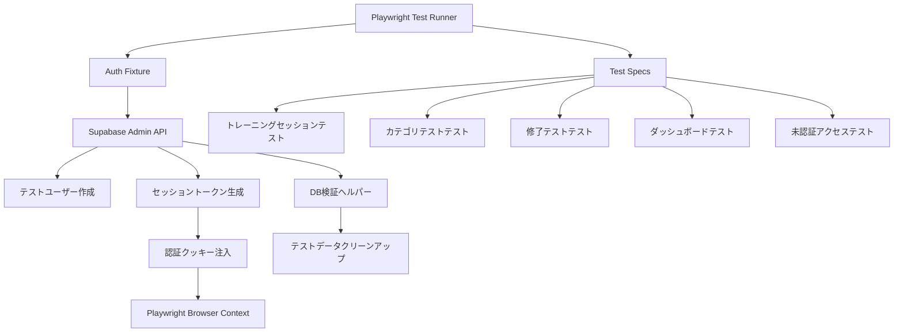
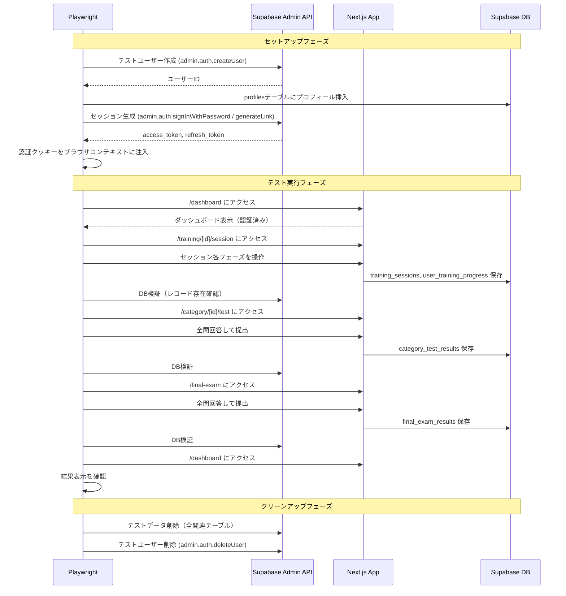

# 設計書: E2Eフルフローテスト

## 概要

Playwrightを使用して、日本語営業トレーニングプラットフォームの完全なユーザージャーニーをカバーするE2Eテストスイートを構築する。Google OAuthは自動化不可のため、Supabase Admin APIでテストユーザーを作成し、セッショントークンを生成してPlaywrightブラウザに認証クッキーを注入するバイパス方式を採用する。

テストは以下のフローを順番に実行する:
1. 認証バイパスによるログイン状態の確立
2. トレーニングセッションの実行と完了
3. カテゴリテストの受験と結果確認
4. 修了テストの受験と結果確認
5. ダッシュボードでの結果反映確認
6. テストデータのクリーンアップ

## アーキテクチャ



### テスト実行フロー



## コンポーネントとインターフェース

### 1. Playwright設定 (`playwright.config.ts`)

```typescript
import { defineConfig } from '@playwright/test'

export default defineConfig({
  testDir: './e2e',
  timeout: 60_000,
  retries: 1,
  use: {
    baseURL: 'http://localhost:3000',
    trace: 'on-first-retry',
  },
  projects: [
    { name: 'chromium', use: { browserName: 'chromium' } },
  ],
})
```

### 2. 認証フィクスチャ (`e2e/fixtures/auth.ts`)

Playwrightのカスタムフィクスチャとして認証バイパスを実装する。

```typescript
interface AuthFixture {
  testUserId: string
  authenticatedPage: Page
}

// Supabase Admin APIを使用してテストユーザーを作成
async function createTestUser(): Promise<{ userId: string; email: string }>

// セッショントークンを生成してクッキーに注入
async function injectAuthSession(
  context: BrowserContext,
  userId: string,
  email: string
): Promise<void>

// テストユーザーと関連データを削除
async function cleanupTestUser(userId: string): Promise<void>
```

認証クッキー注入の方式:
- `supabase.auth.admin.createUser()` でメール+パスワードのテストユーザーを作成
- `supabase.auth.admin.generateLink()` でマジックリンクを生成し、トークンを取得
- または `supabase.auth.signInWithPassword()` でセッションを取得
- 取得した `access_token` と `refresh_token` を Supabase のクッキー形式（`sb-<project-ref>-auth-token`）でブラウザコンテキストに設定

### 3. DB検証ヘルパー (`e2e/helpers/db-verify.ts`)

Supabase Admin Clientを使用してテスト結果をDBから直接検証する。

```typescript
interface DbVerifyHelper {
  // training_sessions テーブルからユーザーのレコードを取得
  getTrainingSessions(userId: string): Promise<TrainingSessionRecord[]>

  // user_training_progress テーブルからユーザーの進捗を取得
  getTrainingProgress(userId: string): Promise<TrainingProgressRecord[]>

  // category_test_results テーブルからユーザーの結果を取得
  getCategoryTestResults(userId: string): Promise<CategoryTestResultRecord[]>

  // final_exam_results テーブルからユーザーの結果を取得
  getFinalExamResults(userId: string): Promise<FinalExamResultRecord[]>

  // ユーザーに関連する全テストデータを削除
  cleanupUserData(userId: string): Promise<void>
}
```

### 4. テストスペック構成

```
e2e/
├── fixtures/
│   └── auth.ts              # 認証フィクスチャ
├── helpers/
│   └── db-verify.ts         # DB検証ヘルパー
├── specs/
│   ├── auth-guard.spec.ts   # 未認証アクセス保護テスト
│   ├── training-session.spec.ts  # トレーニングセッションテスト
│   ├── category-test.spec.ts     # カテゴリテストテスト
│   ├── final-exam.spec.ts        # 修了テストテスト
│   └── dashboard.spec.ts         # ダッシュボード結果確認テスト
└── global-setup.ts          # グローバルセットアップ（環境変数チェック等）
```

## データモデル

### テストユーザー

```typescript
interface TestUserConfig {
  email: string       // `e2e-test-{timestamp}@example.com`
  password: string    // ランダム生成
  name: string        // `E2Eテストユーザー`
  department: string  // `テスト部門`
  role: 'employee'
}
```

### DB検証用レコード型

```typescript
interface TrainingSessionRecord {
  id: string
  user_id: string
  training_id: number
  category_id: string
  training_title: string
  overall_score: number
  max_score: number
  duration_seconds: number
  completed_at: string
}

interface TrainingProgressRecord {
  user_id: string
  training_id: number
  category_id: string
  status: string
  completed_at: string
}

interface CategoryTestResultRecord {
  id: string
  user_id: string
  category_id: string
  score: number
  percentage: number
  passed: boolean
  correct_count: number
  total_questions: number
  duration: number
}

interface FinalExamResultRecord {
  id: string
  user_id: string
  score: number
  percentage: number
  passed: boolean
  correct_count: number
  total_questions: number
  duration: number
  completed_at: string
}
```

### 認証クッキー構造

Supabase SSRが使用するクッキー形式:
- クッキー名: `sb-<project-ref>-auth-token`（チャンク分割される場合あり）
- 値: JSON文字列 `{ access_token, refresh_token, expires_in, token_type, ... }`
- `@supabase/ssr` のクッキー分割ロジックに合わせて設定する必要がある


## 正当性プロパティ

*プロパティとは、システムの全ての有効な実行において成り立つべき特性や振る舞いのことである。プロパティは人間が読める仕様と機械的に検証可能な正当性保証の橋渡しとなる。*

本E2Eテストスイートは主にUIインタラクションとDB永続化の統合テストであるため、大部分の受入基準は特定のシナリオに対する例ベースのテストとなる。以下は、プロパティベーステストとして検証可能な普遍的プロパティである。

### Property 1: テスト結果レコードの不変条件

*任意の*テスト結果レコード（カテゴリテスト結果または修了テスト結果）に対して、以下の不変条件が成り立つ:
- `score >= 0`
- `percentage` は 0 以上 100 以下
- `total_questions > 0`
- `correct_count >= 0` かつ `correct_count <= total_questions`
- `duration >= 0`

**Validates: Requirements 4.4, 5.4**

### Property 2: テストデータのプレフィックス識別性

*任意の*テスト実行において、Auth_Bypassが作成するTest_Userのメールアドレスは `e2e-test-` プレフィックスを含み、本番ユーザーのメールアドレスと区別可能である。

**Validates: Requirements 7.4**

## エラーハンドリング

### 認証バイパスのエラー

| エラー状況 | 対応 |
|---|---|
| `SUPABASE_SERVICE_ROLE_KEY` 未設定 | テスト開始前にエラーメッセージを出力して中断 |
| Supabase Admin API接続失敗 | リトライ1回後、失敗時はエラーメッセージを出力して中断 |
| テストユーザー作成失敗 | エラーログを出力してテストスキップ |
| セッショントークン生成失敗 | エラーログを出力してテストスキップ |

### テスト実行中のエラー

| エラー状況 | 対応 |
|---|---|
| ページロードタイムアウト | Playwrightのデフォルトタイムアウト（60秒）で自動失敗 |
| 要素が見つからない | Playwrightのロケーターのタイムアウトで自動失敗 |
| DB検証失敗 | テスト失敗として報告、クリーンアップは実行 |

### クリーンアップのエラー

| エラー状況 | 対応 |
|---|---|
| テストデータ削除失敗 | 警告ログを出力（テスト結果には影響しない） |
| テストユーザー削除失敗 | 警告ログを出力（次回テスト実行時に古いテストユーザーが残る可能性あり） |
| テスト中断時のクリーンアップ | Playwrightの `afterAll` / `afterEach` フックで確実に実行 |

## テスト戦略

### テストフレームワーク

- **E2Eテスト**: Playwright（`@playwright/test`）
- **プロパティベーステスト**: `fast-check`（Vitest上で実行）
- **ユニットテスト**: Vitest（既存のセットアップを活用）

### デュアルテストアプローチ

**ユニットテスト / 例ベーステスト（Playwright）**:
- 認証バイパスの動作確認（特定のシナリオ）
- 各ページのUI表示確認
- フロー遷移の確認
- DB永続化の確認
- 未認証アクセスのリダイレクト確認

**プロパティベーステスト（fast-check + Vitest）**:
- テスト結果レコードの不変条件検証（Property 1）
- テストデータのプレフィックス識別性検証（Property 2）
- 最低100イテレーション実行

### プロパティベーステスト設定

- ライブラリ: `fast-check`
- 実行環境: Vitest
- 各テストに最低100イテレーション
- 各テストにデザインドキュメントのプロパティ番号をコメントで参照
- タグ形式: `Feature: e2e-full-flow-test, Property {number}: {property_text}`

### テスト実行順序

E2Eテストは以下の順序で実行する（データ依存関係のため）:

1. `auth-guard.spec.ts` - 未認証アクセス保護（独立して実行可能）
2. `training-session.spec.ts` - トレーニングセッション（認証必要）
3. `category-test.spec.ts` - カテゴリテスト（認証必要）
4. `final-exam.spec.ts` - 修了テスト（認証必要）
5. `dashboard.spec.ts` - ダッシュボード確認（上記テスト完了後のデータを確認）
