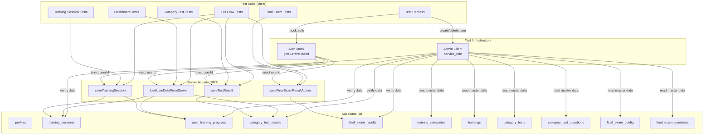

# Design Document: E2E Integration Test

## Overview

サーバーアクション/Supabase APIレベルの統合テストスイートを構築する。ブラウザE2Eテストではなく、vitestからサーバーアクションの内部ロジックを直接呼び出し、実際のSupabaseデータベースに対してテストを実行する。

テストの核心的な課題は、Next.jsのサーバーアクションが`cookies()`経由で認証ユーザーを取得する設計になっている点である。テスト環境ではcookieコンテキストが存在しないため、以下の戦略を採用する：

1. サーバーアクションを直接呼び出すのではなく、サーバーアクション内のビジネスロジック（採点、データ保存）をSupabase Admin Clientで再現する
2. `getCurrentUserId()`が依存する`createClient()`をモックし、テストユーザーのIDを返すようにする
3. データの検証はAdmin Client（service_role）で直接DBをクエリする

## Architecture



### テスト戦略の2つのアプローチ

テストは2層で構成する：

1. **Direct DB Tests（Admin Client経由）**: サーバーアクションのcookie依存を回避し、Admin Clientで直接DBに書き込み・読み取りを行うテスト。採点ロジックをテスト側で再実装し、DB制約やデータ整合性を検証する。
2. **Mocked Server Action Tests**: `getCurrentUserId()`をvitest.mockでモックし、サーバーアクションを直接呼び出すテスト。サーバーアクション内のバリデーション、エラーハンドリング、採点ロジックを検証する。

## Components and Interfaces

### 1. TestHarness (`__tests__/integration/helpers/test-harness.ts`)

テストユーザーのライフサイクル管理を担当する。

```typescript
interface TestHarness {
  // テストユーザーを作成し、profilesレコードも作成
  createTestUser(): Promise<{ userId: string; email: string }>
  
  // テストユーザーに紐づく全データを削除し、ユーザー自体も削除
  cleanup(userId: string): Promise<void>
  
  // Admin Clientのインスタンスを取得
  getAdminClient(): SupabaseClient
}
```

### 2. MasterDataHelper (`__tests__/integration/helpers/master-data.ts`)

テストに必要なマスターデータ（カテゴリ、研修、テスト問題等）を取得する。

```typescript
interface MasterDataHelper {
  // 既存のカテゴリとその研修一覧を取得
  getCategories(): Promise<Category[]>
  
  // カテゴリテストの設定と問題を取得
  getCategoryTest(categoryId: string): Promise<CategoryTestWithAnswers>
  
  // 修了テストの設定と問題を取得
  getFinalExam(): Promise<FinalExamWithAnswers>
}
```

### 3. ScoringHelper (`__tests__/integration/helpers/scoring.ts`)

サーバーサイド採点ロジックのテスト用再実装。サーバーアクション内の採点ロジックと同一のアルゴリズムを使用する。

```typescript
interface ScoringHelper {
  // カテゴリテストの採点（サーバーアクションと同一ロジック）
  scoreCategoryTest(answers: number[], correctAnswers: number[], passingScore: number, totalQuestions: number): {
    correctCount: number
    percentage: number
    passed: boolean
    score: number
  }
  
  // 修了テストの採点
  scoreFinalExam(answers: number[], correctAnswers: number[], passingScore: number, totalQuestions: number): {
    correctCount: number
    percentage: number
    passed: boolean
  }
}
```

### 4. AuthMock (`__tests__/integration/helpers/auth-mock.ts`)

`getCurrentUserId()`のモック設定を管理する。

```typescript
interface AuthMock {
  // 指定したuserIdを返すようにモックを設定
  mockUserId(userId: string): void
  
  // 未認証状態（null）を返すようにモックを設定
  mockUnauthenticated(): void
  
  // モックをリセット
  reset(): void
}
```

## Data Models

### テスト対象テーブルのスキーマ

```typescript
// profiles（FK参照先 - テストユーザー作成時に必要）
interface Profile {
  id: string          // UUID, auth.users.id への参照
  email: string
  name: string
  department: string
  join_date: string   // DATE
  role: 'employee' | 'manager' | 'admin'
}

// training_sessions（研修セッション記録）
interface TrainingSession {
  id: string          // UUID
  user_id: string     // FK → profiles.id ON DELETE CASCADE
  training_id: number
  category_id: string // varchar(10)
  training_title: string
  attempt_number: number
  duration_seconds: number
  overall_score: number  // CHECK: 0 <= score <= 200
  max_score: number
  completed_at: string
  category_name: string
}

// user_training_progress（研修進捗）
interface UserTrainingProgress {
  id: string
  user_id: string     // FK → profiles.id ON DELETE CASCADE
  training_id: number
  category_id: string
  status: 'not_started' | 'in_progress' | 'completed'
  completed_at: string
  // UNIQUE(user_id, training_id)
}

// category_test_results（カテゴリテスト結果）
interface CategoryTestResult {
  id: string
  user_id: string     // FK → profiles.id ON DELETE CASCADE
  category_id: string
  category_name: string
  attempt_number: number
  score: number
  percentage: number  // CHECK: 0 <= percentage <= 100
  passed: boolean
  correct_count: number
  total_questions: number
  duration: number
}

// final_exam_results（修了テスト結果）
interface FinalExamResult {
  id: string
  user_id: string
  completed_at: string
  score: number
  percentage: number
  passed: boolean
  correct_count: number
  total_questions: number
  duration: number
}
```

### マスターデータテーブル（読み取り専用）

```typescript
// category_tests + category_test_questions
interface CategoryTestConfig {
  id: number
  category_id: string
  category_name: string
  total_questions: number
  passing_score: number  // パーセンテージ
  time_limit: number
  questions: {
    question_number: number
    correct_answer: number  // 正解の選択肢インデックス
  }[]
}

// final_exam_config + final_exam_questions
interface FinalExamConfig {
  total_questions: number
  passing_score: number  // パーセンテージ
  time_limit: number
  questions: {
    question_number: number
    correct_answer: number
  }[]
}
```

### 重要なDB制約

- `training_sessions.user_id` → `profiles.id` ON DELETE CASCADE（profilesレコードが先に必要）
- `user_training_progress` UNIQUE(user_id, training_id)（upsert対応）
- `category_test_results.percentage` CHECK(0 <= percentage <= 100)
- `training_sessions.overall_score` CHECK(0 <= score <= 200)（migration修正済み）
- `category_test_results.user_id` → `profiles.id` ON DELETE CASCADE


## Correctness Properties

*A property is a characteristic or behavior that should hold true across all valid executions of a system—essentially, a formal statement about what the system should do. Properties serve as the bridge between human-readable specifications and machine-verifiable correctness guarantees.*

### Property 1: Training session save round-trip

*For any* valid training session data (valid odaiNumber, categoryId, score within range, positive duration), saving it via `saveTrainingSession` should result in both a `training_sessions` record with matching fields AND a `user_training_progress` record with `status="completed"` for that user/training combination.

**Validates: Requirements 2.1, 2.2**

### Property 2: Multiple completion accumulation

*For any* user and training, completing the same training N times should result in exactly N `training_sessions` records and exactly 1 `user_training_progress` record (due to UNIQUE constraint and upsert).

**Validates: Requirements 2.3**

### Property 3: Score normalization

*For any* score value (including NaN, Infinity, negative numbers, values exceeding maxScore), `saveTrainingSession` should save an `overall_score` that satisfies `0 <= overall_score <= maxScore` and is an integer.

**Validates: Requirements 2.4**

### Property 4: Category test scoring correctness

*For any* set of answers and corresponding correct answers from `category_test_questions`, the scoring should satisfy: `correctCount` equals the number of element-wise matches, `percentage` equals `Math.round((correctCount / totalQuestions) * 100)`, `passed` equals `percentage >= passingScore`, and `score` equals `correctCount * 2`. The resulting `category_test_results` record should contain all these computed values.

**Validates: Requirements 3.1, 3.2, 3.3, 3.4**

### Property 5: Final exam scoring correctness

*For any* set of answers and corresponding correct answers from `final_exam_questions`, the scoring should satisfy: `correctCount` equals the number of element-wise matches, `percentage` equals `Math.round((correctCount / totalQuestions) * 100)`, and `passed` equals `percentage >= passingScore`. The resulting `final_exam_results` record should contain all these computed values.

**Validates: Requirements 4.1, 4.2, 4.3**

### Property 6: Load user data round-trip

*For any* authenticated user with saved training sessions, training progress, and category test results, calling `loadUserDataFromServer` should return arrays where each saved record appears in the corresponding array (sessions, progress, tests).

**Validates: Requirements 5.1, 5.2, 5.3**

### Property 7: Cleanup completeness

*For any* test user created by the Test Harness, after cleanup, querying all target tables (training_sessions, user_training_progress, category_test_results, final_exam_results, profiles) with that user's ID should return zero records.

**Validates: Requirements 1.3, 1.4, 7.2**

## Error Handling

### 認証エラー

- `getCurrentUserId()`がnullを返す場合、全サーバーアクションは`{ success: false, error: "Unauthorized" }`を返す
- テストでは`vi.mock`で`getCurrentUserId`をモックし、null返却時の挙動を検証する

### DB制約違反

- `training_sessions.overall_score` CHECK制約（0-200）: サーバーアクション側で事前にクランプするため、DB制約違反は発生しない
- `category_test_results.percentage` CHECK制約（0-100）: 採点ロジックが正しければ違反しない
- `profiles.id` FK制約: テストユーザー作成時にprofilesレコードを先に作成することで回避

### マスターデータ不在

- 存在しないcategoryIdでのテスト: `{ success: false, error: "Test config not found" }`
- final_exam_config/questionsが存在しない場合: `{ success: false, error: "Exam data not found" }`

### クリーンアップエラー

- 各テーブルの削除を個別にtry-catchで囲み、1つのテーブル削除が失敗しても残りを継続する
- エラーはconsole.errorでログ出力する

## Testing Strategy

### テストフレームワーク

- **vitest** ^4.0.18（既存プロジェクトで使用中）
- **Property-based testing**: `fast-check`ライブラリを使用
- テスト設定: `vitest.config.mts`の`include`パターンに`__tests__/integration/**/*.test.ts`を追加

### テストファイル構成

```
__tests__/
  integration/
    helpers/
      test-harness.ts       # テストユーザー管理
      master-data.ts        # マスターデータ取得
      scoring.ts            # 採点ロジック再実装
      auth-mock.ts          # 認証モック
    training-session.test.ts  # Req 2: 研修セッション
    category-test.test.ts     # Req 3: カテゴリテスト
    final-exam.test.ts        # Req 4: 修了テスト
    dashboard.test.ts         # Req 5: ダッシュボード
    full-flow.test.ts         # Req 6: フルフロー
    cleanup.test.ts           # Req 7: クリーンアップ
```

### Dual Testing Approach

- **Unit tests**: 特定のエッジケース（全問正解、全問不正解、未認証、不正スコア値）を検証
- **Property tests**: fast-checkを使用し、ランダムな回答配列・スコア値に対する採点ロジックの正しさを検証

### Property-Based Testing Configuration

- ライブラリ: `fast-check`
- 各プロパティテストは最低100イテレーション実行
- 各テストにはデザインドキュメントのプロパティ番号をタグとしてコメントに記載
- タグ形式: `Feature: e2e-integration-test, Property {number}: {property_text}`
- 各correctness propertyは1つのproperty-based testで実装する

### テスト実行の前提条件

- Supabase環境変数が設定されていること（`NEXT_PUBLIC_SUPABASE_URL`, `NEXT_PUBLIC_SUPABASE_ANON_KEY`, `SUPABASE_SERVICE_ROLE_KEY`）
- DBにマスターデータ（training_categories, trainings, category_tests, category_test_questions, final_exam_config, final_exam_questions）が存在すること
- テストは`vitest --run`で実行（watchモードではない）
